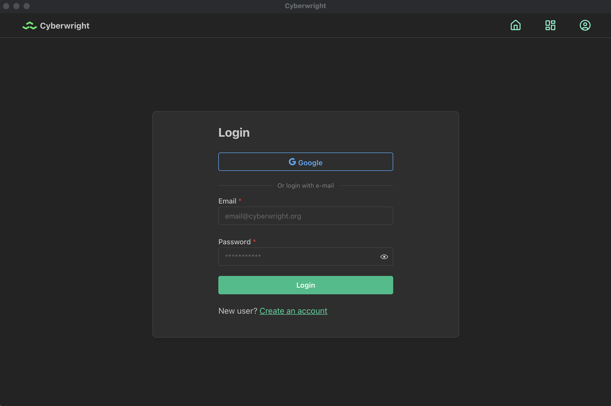
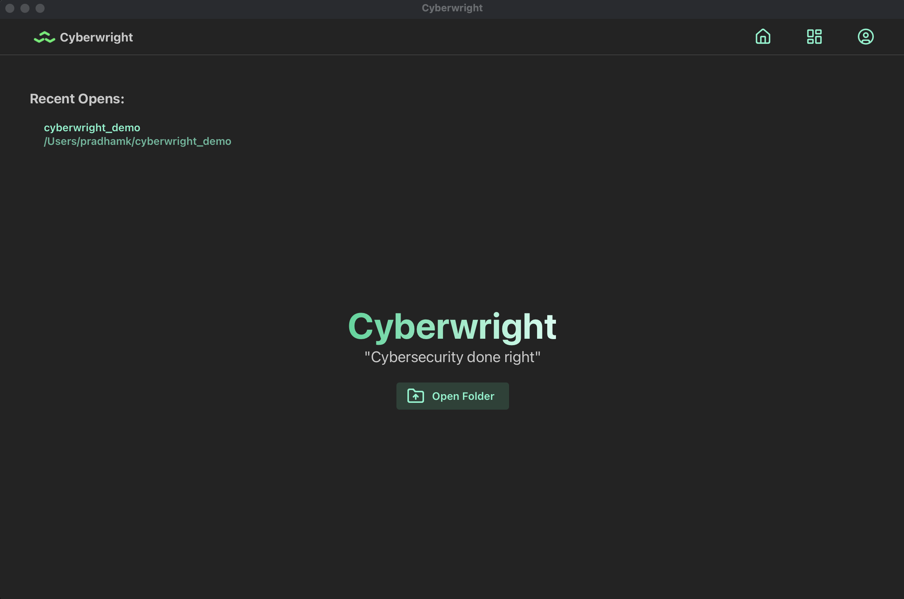
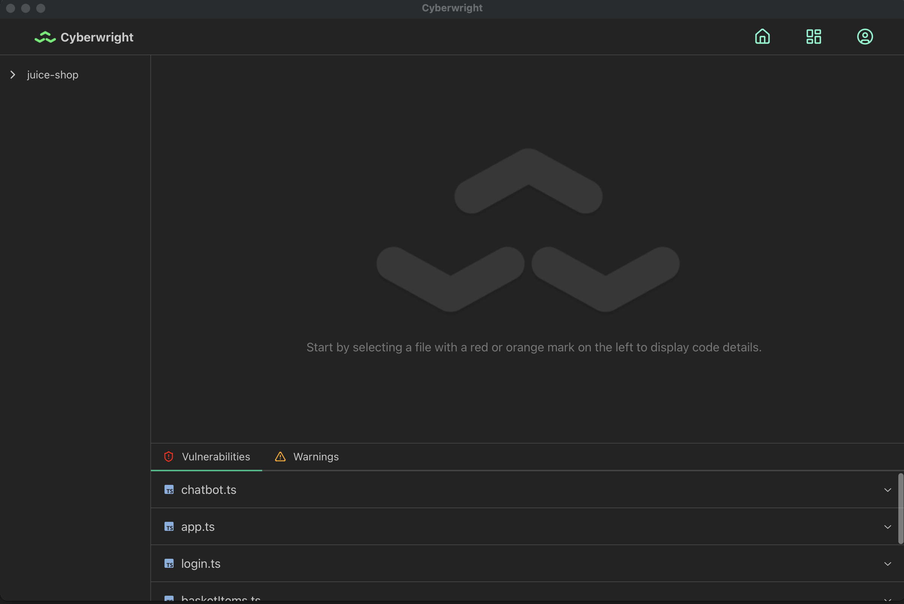
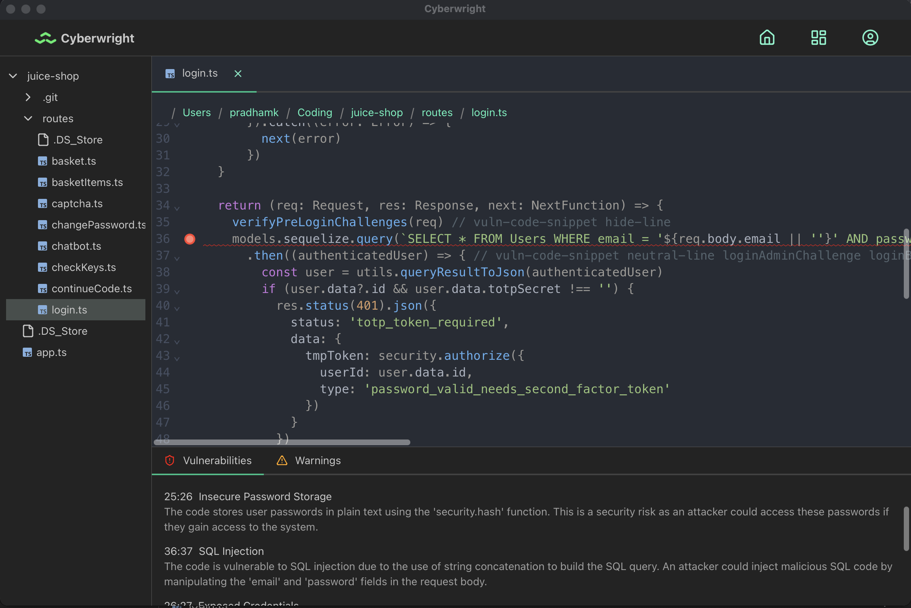

# Cyberwright-App
  
--- 

This is the Cyberwright desktop app source code. Built using Tauri, this app enables users to upload their code directories via the app and receive feedback on possible code vulnerabilities.

The UI was implemented using TailwindCSS, with NextJS as the driving React framework. 

## To Run
In order to use the Cyberwright app, you must first have the [Cyberwright backend](https://github.com/TheCyberwrightProject/cyberwright-backend) running as well. 
1. Modify the contents of [src-tauri/constants.rs](src-tauri/constants.rs) to ensure the app uses the correct API and Google Client ID (which is used for Google authentication).
>In order to obtain a **Google Client ID**, you must create OAuth credentials via the Google Cloud Console.
2.   Run the app by running `npm run tauri dev`.
>For best performance, run `npm run tauri build`. This will generate an optimized binary of our app.

## Example App Views

 